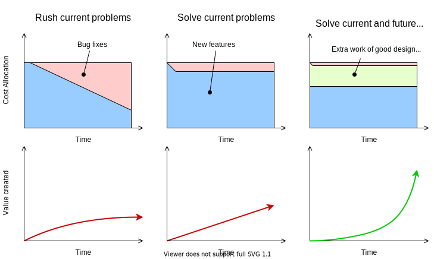

Tech companies don't just build once-off products for customers. It's a cycle of constant iteration. Software engineers don't just write code to solve a customer's present problem, some of their code will be used to solve future problems. How software engineers write their code directly determines the balance between the cost of creating present value for customers, and the cost of creating future value for customers. This is a question of strategy. See the following payoff charts for each strategy, which shows how rushing is counter-productive and accumulates technical debt, which crushes future productivity:

Following the third strategy means you start off slower, but you're building technical capital, which makes your productivity grow like compound interest.

This article advocates for the third strategy, and argues that beautiful code is a quick and accurate way for developers to avoid technical debt before it is created, and to create 'technical capital'.

## What is technical debt and technical capital?

Much has been written about technical debt ([example](https://martinfowler.com/bliki/TechnicalDebt.html)), and is essentially a bargain to ship something faster now in exchange for shipping things slower in the future by making it require more work. Technical debt is a term invented for managers to understand why a new feature is taking so long, and convince them that it makes financial sense to invest time in clearing up spaghetti code. Refactoring is [generally accepted](https://medium.com/tag-bio/refactoring-is-the-cure-for-technical-debt-but-only-if-you-take-it-9fd8cc42dd93) as the cure for technical debt once it exists. 

Management needs to strike a careful and deliberate balance between shipping fast now, and shipping fast in the future. Sometimes, it makes sense to take on some technical debt. For example, you might need to ship fast now to land a big customer. But shipping fast all the time is an unsustainable and counter-productive strategy.

<iframe width="560" height="315" src="https://www.youtube.com/embed/zPT-DuG0UjU" title="YouTube video player" frameborder="0" allow="accelerometer; autoplay; clipboard-write; encrypted-media; gyroscope; picture-in-picture" allowfullscreen></iframe>

> What kind of runner can run as fast as they possibly can from the very start of a race?
>
> [Audience reply: Sprinter]
>
> Right, only somebody who runs really short races, okay?
>
> [Audience laughter]
>
> But of course, we are programmers, and we are smarter than runners, apparently, because we know how to fix that problem, right? We just fire the starting pistol every hundred yards and call it a new sprint.
>
> -- <cite>Rich Hickey, [Simple Made Easy](https://github.com/matthiasn/talk-transcripts/blob/master/Hickey_Rich/SimpleMadeEasy.md) ([video clip](https://www.youtube.com/watch?v=zPT-DuG0UjU))</cite>

To spell it out, accumulating technical debt directly lowers how much value you can create for your customers after the shortcut is taken. It only makes sense to ship at full speed if the short term win is disproportionally bigger than subsequent wins.

The opposite of technical debt is where adding new features is made _easier_, not harder, by previous work. We can call this 'technical capital'. The more technical capital available, the more the team can reuse past work and be more productive to create value for customers and add more technical capital. As mentioned, this capital grows like compound interest, and proportionally boosts general productivity. 

## Why is technical debt a real problem?

Here are some symptoms:

- Slow and difficult maintainance
- Sales is breaking their promises
- Low developer morale - a feeling of dread when thinking about a codebase
- More time is spent fixing issues rather than shipping new features ([source](https://thevaluable.dev/fighting-software-entropy/))
- Similar problems are solved without reusing existing work
- The code is littered with linter warnings and code smells ([source](https://www.castsoftware.com/blog/the-symptoms-and-causes-of-technical-debt))

## Beautiful code as a proxy for technical capital

In the trenches of day to day software development, engineers don't have antennae for such an abstract thing as technical debt and capital before their symptoms arise. How can I know that this code I'm writing is going to cause the above problems? At the same time, how do I not go overboard and waste time trying to make it more perfect than it needs to be?

When dealing with complex decisions, heuristics are best. It's even easier when we have an instinctive reaction to guide us. Fortunately, 84% of novices, and 100% of experts, have aesthetic reactions to code ([study](https://www.researchgate.net/publication/232443360_The_Aesthetics_of_Software_Code_A_Quantitative_Exploration)) - some more than others. Some people feel joy at beautiful code, and disgust or dread at ugly code. Others are more indifferent.

Below are some principles for beautiful code which are worded with aesthetic connotations for that reason:

### [Clarity](https://softwareengineering.stackexchange.com/a/207932), rather than Confusion

To someone reading the code, it must be easy to understand what it does.

Here are some objective guidelines:

_Optimise for readability rather than minimum lines of code_

Beautiful code does not try to solve a problem with the least amount of keystrokes and sneaky language tricks that make the author look smart. There is no reason to optimise for fewest lines of code itself - that should only be a consequence rather than a primary goal. You can still use cool functional programming techniques, but rather than nesting 

_Use immutable data_

Immutable data cannot be changed once it is created. Treating data immutably greatly reduces the possible logic paths that a reader needs to understand. 

On the other end of the spectrum to immutable data is mutability hell, where data is initialised, then conditionally changed, iterated over, changed by code in other methods or files, and the poor reader is lost in an overwhelmingly tangled web of logic. To make a change is a nightmare - the first problem is understanding what to change, the next is to make sure that it doesn't break anything else. In these sorts of scenarios, its tempting to skip the most important step of figuring out what the hell it actually does. Back when computer programs had to fit everything in 4kb of RAM, we could only change or _mutate_ existing values in memory. Except for ultra-performant systems, there is almost no need to use mutable data these days.

The cognitive complexity of understanding mutable-style code scales ~~exponentially~~ factorially at worst, since any mutation can react to previous mutations, resulting in a giant tree of possible values. This tree of possibilities is sometimes impossible to understand. On the other hand, writing code with immutable data is much simpler since the logic complexity scales linearly to the number of operations.

_Composition and [orthoganality](https://en.wikipedia.org/wiki/Orthogonality%5F%28programming%29), rather than [coupling](https://en.wikipedia.org/wiki/Coupling%5F%28computer%5Fprogramming%29)_

Problems should be untangled to identify all the subproblems that can be solved independently, and then the code should be composed of separate solutions to each of these subproblems. When solutions are coupled, a change in one place forces a ripple effect of changes elsewhere, they are harder to understand, and it is less easily reused and tested. Other than untangling specific problems, a general thing to do is to untangle hardcoded data from logic. The 'single responsibility principle' is related, but not the same thing.

_Co-location of logic_

Related logic should be co-located or easily findable. This is one big benefit of OOP - methods which affect a data structure are grouped within the same file.

### [Elegance](https://softwareengineering.stackexchange.com/a/207932), rather than Complication

Beautiful code is not wasteful or repetitive. The underlying algorithm is expressed naturally and not overcomplicated with unnecessary idioms. Like the composition point above, the whole solution is composed of reusable, smaller solutions.

### Stylistic

Code should consistently follow standard style conventions for that language. This includes code layout, spacing, commenting. This makes it more familiar and reduces the cognitive load to a reader.

## Conclusion

The strategy of building technical capital by writing beautiful code starts off slow, but in the medium to long term, generates superior value to shipping as fast as possible. Although, certain opportunities sometimes require the accumulation of technical debt.

Beautiful code and the principles of clarity, elegance and style are a great way for developers to sense how to write code that promotes technical capital, and therefore has a direct impact on how much value gets delivered to customers.
